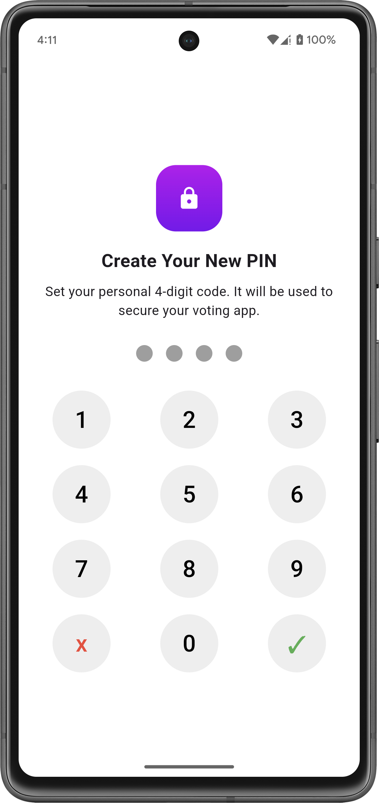
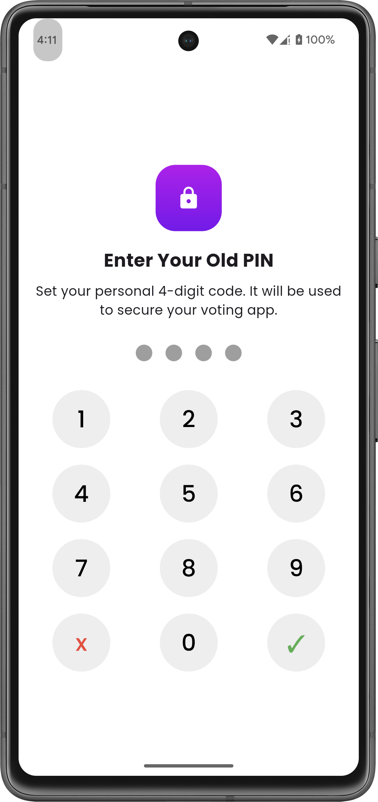
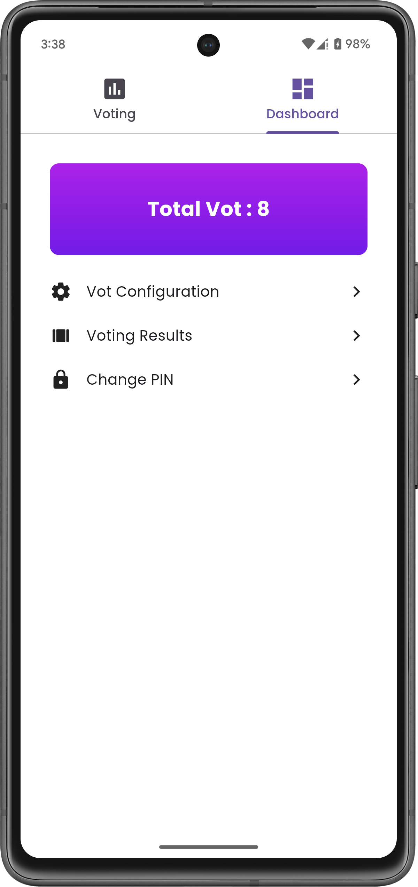
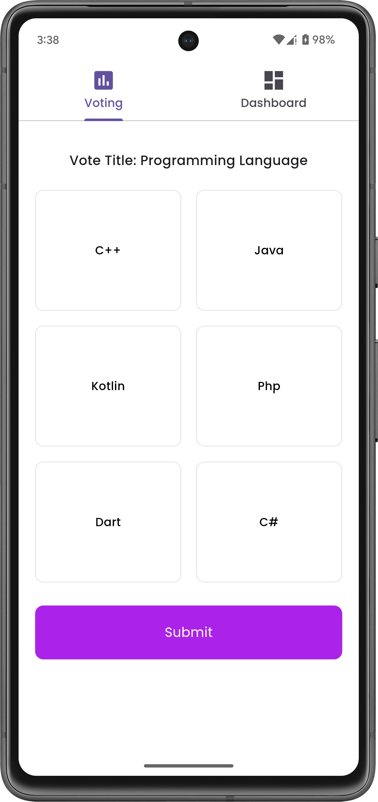

## 🚀 Built a Secure Local Voting App with Flutter! 🗳️

I've been diving deep into Flutter UI development, and my latest project is a voting app that allows users to: 

✅ Create a vote locally 
✅ Cast their votes securely 
✅ View real-time results 
✅ Ensure security with a PIN system 

For state management and data storage, I used GetX and Get Storage, making the app smooth and efficient. 🔥 
This project was a great learning experience in handling user authentication, local data persistence, and UI/UX design. 

## 🌟 Screenshots

   &nbsp;&nbsp;&nbsp;
   &nbsp;&nbsp;&nbsp;
  

 

   &nbsp;&nbsp;&nbsp;
   &nbsp;&nbsp;&nbsp;
  

